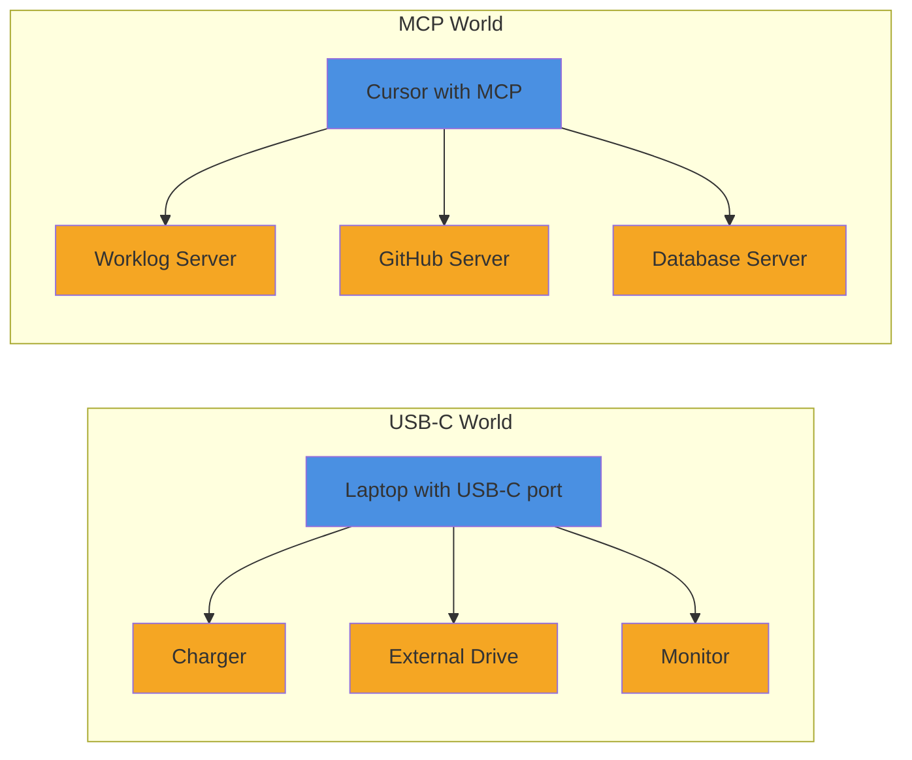
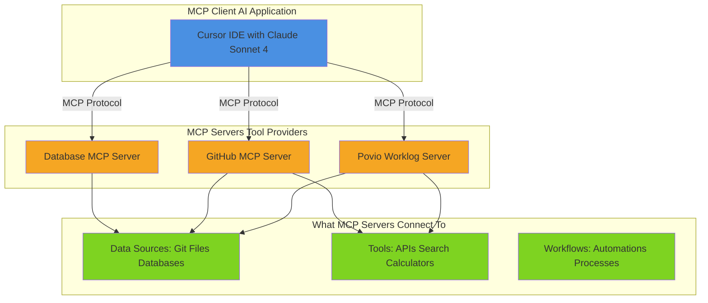
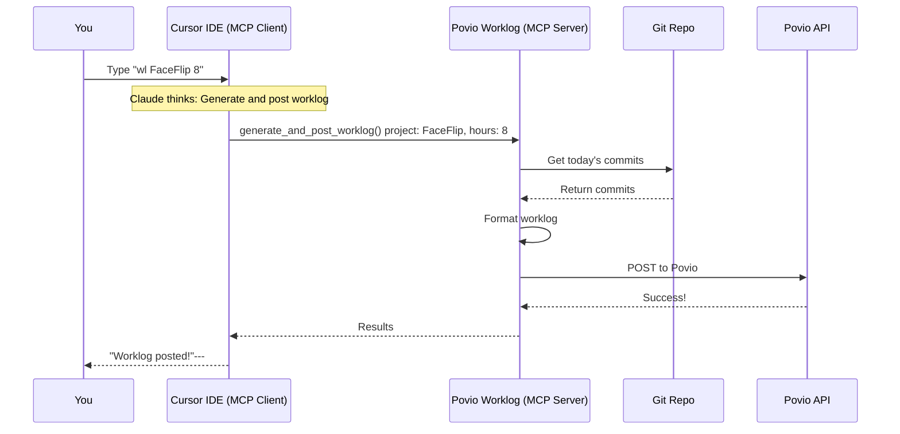
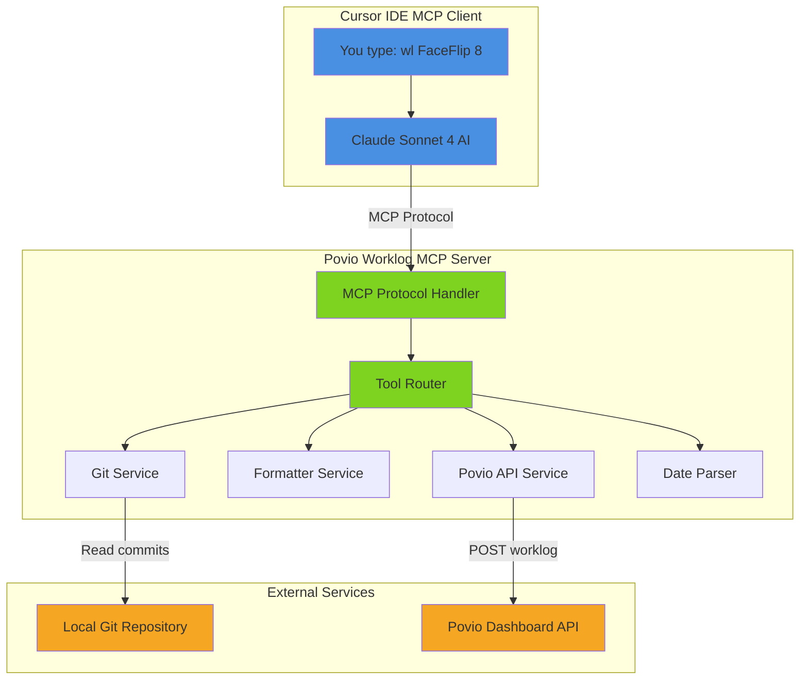
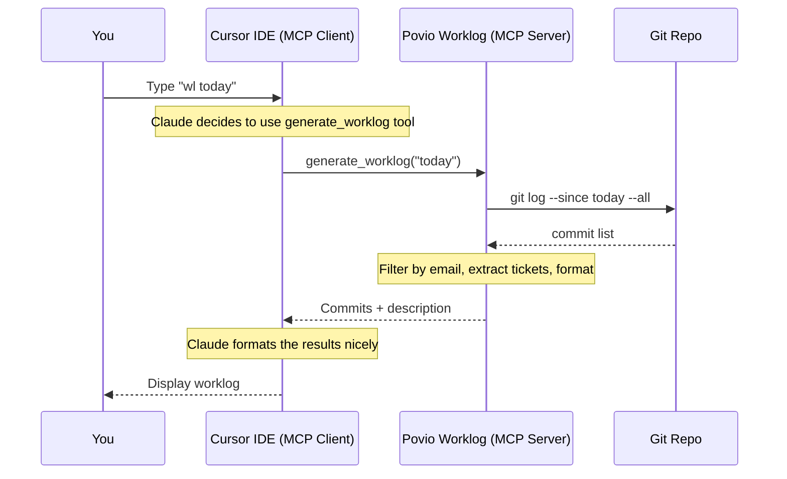

# Povio Worklog MCP Server

## Automating Developer Worklogs with AI

**Egzon Arifi**  
**October 2025**

---

## 📋 Agenda (15-20 min)

1. **What is MCP?** (3-4 min)  
   *Understanding the USB-C for AI*

2. **The Problem** (2 min)  
   *Why worklog submission is painful*

3. **The Solution** (3-4 min)  
   *Automating worklogs with MCP*

4. **How It Works** (4-5 min)  
   *Cursor → MCP Server → Git & API*

5. **Live Demo** (2-3 min)  
   *"wl FaceFlip 8" and done!*

6. **Questions** (1-2 min)

### Key Message

**MCP lets AI applications (like Cursor) connect to external tools (like our worklog server) using a standard protocol - making automation seamless!**

---

## 🤔 What is MCP?

### Model Context Protocol

**MCP** is an **open-source standard** that allows AI applications to connect to external systems.

**Created by:** Anthropic  
**Purpose:** Standardize how AI connects to data sources, tools, and workflows

### What Can MCP Enable?

Real-world examples from the MCP ecosystem:

- 🗓️ **Personal AI**: Claude accesses your Google Calendar and Notion
- 🎨 **Design to Code**: Cursor generates web apps from Figma designs
- 📊 **Enterprise**: AI chatbots query multiple databases across your organization
- 🔧 **Our Use Case**: Cursor automates Povio worklog submissions from git commits

### Think of MCP as...

- **USB-C** → for connecting devices
- **REST API** → for web services
- **GraphQL** → for data queries
- **MCP** → for connecting AI to external systems

---

## 🔌 MCP = USB-C for AI

### The Perfect Analogy



| Aspect          | USB-C                   | MCP                               |
| --------------- | ----------------------- | --------------------------------- |
| **Device**      | Laptop with port        | Cursor IDE (MCP Client)           |
| **Standard**    | USB-C protocol          | MCP protocol                      |
| **Accessories** | Charger, drive, monitor | Worklog, GitHub, database servers |
| **Benefit**     | One port, many devices  | One AI app, many tools            |

**Key Insight:** Just like USB-C lets your laptop connect to any USB-C device, MCP lets AI applications connect to any MCP server!

---

## 🧩 The Two Parts of MCP

### Understanding MCP Architecture (Simplified)



**MCP enables AI to connect to: Data Sources + Tools + Workflows**

---

## 🎯 MCP Components Explained

### 1. **MCP Client** - The AI Application (Cursor)

**What is it?** An AI application that connects to MCP servers

**Think of it as:** Your USB-C device (laptop, phone) that can plug into accessories

**In our case: Cursor IDE**

- 🖥️ **Cursor** is the MCP Client
- 🤖 **Claude Sonnet 4** is the AI brain inside Cursor
- Together, they connect to MCP servers to get things done

**What Cursor does:**

1. You type: `"wl FaceFlip 8"`
2. Claude understands: "Generate worklog, post to FaceFlip, 8 hours"
3. Cursor connects to povio-worklog MCP server
4. Shows you the results

**Other MCP Clients:**

- 💬 Claude Desktop App
- 🌐 VS Code with MCP extensions
- 🤖 Custom AI applications

### 🧠 Wait, what about Claude Sonnet 4?

**Important clarification:**

- **Cursor IDE** = The MCP Client (the application)
- **Claude Sonnet 4** = The AI model running inside Cursor (the brain)

Think of it this way:

- 🖥️ **Cursor** is like your web browser
- 🤖 **Claude Sonnet 4** is like the JavaScript engine inside it
- Together, they form the **MCP Client** that connects to MCP servers

**Analogy:** 

- Chrome (browser) + V8 (JavaScript engine) = Web application
- Cursor (IDE) + Claude (AI model) = MCP Client

---

### 2. **MCP Server** - The Tool Provider

**What is it?** A lightweight program that exposes capabilities to MCP clients

**Think of it as:** USB-C accessories (charger, external drive, display)

**Examples from the ecosystem:**

- 📊 **Povio Worklog MCP Server** (ours!)
- 🐙 **GitHub MCP Server** (GitHub integration)
- 🗄️ **Postgres MCP server** (Database queries)
- 🔍 **Brave Search MCP Server** (Web search)
- 🗂️ **Filesystem MCP Server** (Local files)

**What MCP servers can provide:**

- 📁 **Data Sources**: Git commits, files, databases, APIs
- 🔧 **Tools**: Search, calculations, API calls, data processing
- 📝 **Workflows**: Multi-step processes, automations

**Our Povio Worklog Server provides:**

- 📁 **Data**: Git commit history (data source)
- 🔧 **Tools**: Format worklogs, post to Povio API (tools)
- 📝 **Workflow**: Generate + AI enhance + post (automated workflow)

---

## 🔄 How They Work Together

### Real Example with Cursor



## 💡 Key Concepts Summary

### MCP in Simple Terms

**MCP Client (Cursor):**

- ✅ The AI application you interact with
- ✅ Has Claude Sonnet 4 as its "brain"
- ✅ Connects to multiple MCP servers
- ✅ Understands natural language commands

**MCP Servers (like povio-worklog):**

- ✅ Lightweight programs that expose capabilities
- ✅ Connect to data sources (git, files, databases)
- ✅ Provide tools (APIs, search, calculations)
- ✅ Enable workflows (multi-step automations)

**MCP Protocol:**

- ✅ Standard way for clients and servers to communicate
- ✅ Like USB-C - one standard, infinite possibilities
- ✅ Open source and growing ecosystem

### The Flow

```
1. You type in Cursor: "wl FaceFlip 8"
2. Cursor (with Claude) understands your intent
3. Cursor connects to povio-worklog MCP server
4. Server reads git commits, formats worklog, posts to API
5. Cursor shows you the result

All in your IDE, no context switching!
```

---

## 🎯 Why MCP Matters

### Before MCP

**Every AI application needed custom integrations:**

- ❌ Different API for every data source/tool
- ❌ No standard way to connect AI to external systems
- ❌ Every integration is custom-built
- ❌ Limited reusability across different AI applications

### With MCP

**One standard protocol, like USB-C for AI:**

- ✅ **For Developers**: Build once, works with any MCP client (Cursor, Claude Desktop, etc.)
- ✅ **For AI Applications**: Access an ecosystem of ready-made MCP servers
- ✅ **For End Users**: More capable AI applications that can access your data
- ✅ **For Everyone**: Growing ecosystem of MCP servers to use

### Real-World Benefits

| Benefit                | Impact                               |
| ---------------------- | ------------------------------------ |
| 🔌 **Standardization** | MCP servers work with ANY MCP client |
| 🚀 **Faster Dev**      | No need to build custom integrations |
| 🌐 **Ecosystem**       | Reuse existing MCP servers from npm  |
| 🔓 **Open Source**     | Free, transparent, community-driven  |

---

## 😫 The Problem

### Current Worklog Workflow at Povio

```bash
# 1. Check what you worked on
$ git log --since="today"
# Copy commits manually... 📋

# 2. Open browser
# Navigate to Povio dashboard 🌐

# 3. Fill in form manually
# - Select project from dropdown
# - Type description (client-facing!)
# - Enter hours
# - Submit ✍️

# 4. Repeat for each day...
```

### Pain Points

- ⏰ **Time-consuming**: 5-10 minutes per day
- 🔄 **Repetitive**: Same process every day
- ❌ **Error-prone**: Typos, wrong projects, poor descriptions
- 📝 **Context switching**: Git → Browser → Form
- 😰 **End-of-week panic**: "What did I do on Tuesday?!"

---

## 💡 The Solution

### Transform This:

```bash
# Old way (5+ minutes)
$ git log --since="today"
# Copy commit messages
# Open Povio dashboard
# Fill in project, hours, description
# Submit
```

### Into This (in Cursor):

```bash
# New way (5 seconds) - Just type in Cursor Chat or Composer:
wl FaceFlip 8  # Done! ✓
```

**Everything happens in Cursor - no context switching!**

---

## ⚡ Povio Worklog MCP Server

### Key Features

1. 📋 **List Projects** - View all active Povio projects
2. 🔍 **Generate Worklog** - Analyze git commits automatically
3. 🤖 **AI Enhancement** - Create professional, client-facing descriptions
4. 📤 **Post to Povio** - Submit directly to dashboard
5. ⚡ **Combined Action** - Generate + Post in one command

### Tech Stack

- **Runtime**: Node.js 18+
- **Language**: TypeScript
- **Protocol**: MCP (Model Context Protocol)
- **MCP Client**: Cursor IDE with Claude Sonnet 4
- **MCP Server**: This tool (povio-worklog-mcp)
- **Git**: simple-git library
- **API**: Povio Dashboard REST API

---

## 🏗️ Architecture Overview



**Cursor (MCP Client) connects to MCP servers - you never leave your IDE!**

---

## 🔧 How It Works: Generate Worklog in Cursor



**All happening inside Cursor in seconds!**

---

## 📊 Data Flow Example

### Input: Your Git Commits

```
8e644dc - ENG-155 Implement Screenshot Upload Feature
a2b3c4d - ENG-155 Add error handling for uploads  
d5e6f7g - ENG-155 Update UI for better UX
h8i9j0k - Fix typo in README
```

### Processing

1. **Filter** → Only YOUR commits
2. **Extract** → Ticket numbers: `ENG-155`
3. **Clean** → Remove technical jargon
4. **Combine** → Multiple commits into one description

### Output: Client-Facing Description

**Without AI:**

```
[ENG-155] Implement Screenshot Upload Feature
```

**With AI Enhancement:**

```
[ENG-155] Implemented screenshot upload functionality in developer 
settings with comprehensive error handling and improved user interface 
for enhanced user experience
```

---

## 🛠️ Available MCP Tools

### 1. `list_povio_projects`

```typescript
// No parameters required
// Returns: List of active projects with IDs
```

**Output Example:**

```
Found 6 active project(s):
• FaceFlip (Ios Engineer) - ID: 15886
• Autobiography (Ios Engineer) - ID: 14093
• Team Leads (Lead Engineer) - ID: 13396
• iOS Internal (Ios Engineer) - ID: 13247
```

---

### 2. `generate_worklog`

```typescript
{
  timeframe: "today" | "yesterday" | "2024-10-28",
  repository?: string,        // defaults to current dir
  enhanceWithAI?: boolean    // defaults to true
}
```

**What it does:**

1. Analyzes git commits
2. Filters by your email
3. Extracts ticket numbers (ENG-155, WAY-204, etc.)
4. Generates professional description
5. Returns formatted worklog

---

### 3. `post_worklog`

```typescript
{
  description: string,       // worklog text
  projectName: string,       // "FaceFlip", "Autobiography"
  hours: number,            // 4, 6, 8
  date: string              // "2024-10-28" (YYYY-MM-dd)
}
```

**What it does:**

1. Resolves project name to ID
2. Posts to Povio API
3. Returns confirmation

---

### 4. `generate_and_post_worklog`

```typescript
{
  timeframe: "today" | "yesterday" | "2024-10-28",
  projectName: string,       // "FaceFlip"
  hours: number,            // 8
  repository?: string,
  enhanceWithAI?: boolean   // defaults to true
}
```

**What it does:**

1. Generate worklog from git commits
2. AI enhancement (waits for Claude to optimize)
3. User confirms
4. Posts to Povio

---

## 🎬 Live Demo in Cursor

**All commands work in Cursor Chat (⌘L) or Composer (⌘I)**

### The Magic: Natural Language → Action

No forms, no browser, no context switching. Just type in Cursor:

| What You Type                    | What Happens                               |
| -------------------------------- | ------------------------------------------ |
| `"wl list"`                      | Shows all your Povio projects              |
| `"wl"`                           | Generates worklog from today's git commits |
| `"wl FaceFlip 8"`                | Generates + posts to FaceFlip, 8 hours     |
| `"wl yesterday Autobiography 6"` | Posts yesterday's work to Autobiography    |

---

### Example 1: List Your Projects

**You in Cursor:** `"wl list"`

**Cursor responds:**

```
Found 6 active projects:

• Autobiography (iOS Engineer) - ID: 14093
• FaceFlip (iOS Engineer) - ID: 15886
• Povio Estimations (iOS Engineer) - ID: 14004
• Team Leads (Lead Engineer) - ID: 13396
• iOS Internal (iOS Engineer) - ID: 13247
• Bunny CDN Mobile (iOS Engineer) - ID: 13802
```

✨ **Behind the scenes**: Cursor → Povio Worklog MCP Server → Povio API

---

### Example 2: Generate Worklog from Git

**You in Cursor:** `"wl"`

**Cursor responds:**

```
📊 Found 4 commits for today (Oct 28, 2024):

• 8e644dc - [ENG-155] Implement Screenshot Upload Feature
• a2b3c4d - [ENG-155] Add error handling for uploads
• d5e6f7g - [ENG-155] Update UI for better UX
• h8i9j0k - [ENG-156] Fix bug in settings screen

✍️ Generated description:
[ENG-155] Implemented screenshot upload functionality with error 
handling and UI improvements. [ENG-156] Fixed settings screen bug.
```

✨ **Behind the scenes**: Cursor → MCP Server → Git repo → AI formatting

---

### Example 3: The Full Workflow (Generate + Post)

**You in Cursor:** `"wl FaceFlip 8"`

**Cursor responds:**

```
🔍 Analyzing today's commits...
   Found 4 commits

🤖 AI-enhanced description:
   [ENG-155][ENG-156] Implemented screenshot upload functionality 
   in developer settings with comprehensive error handling and 
   improved UI, resolved settings screen navigation bug

📤 Posting to Povio...
   ✓ Worklog posted successfully!

📋 Summary:
   Date: Oct 28, 2024
   Hours: 8
   Project: FaceFlip (ID: 15886)
```

✨ **Behind the scenes**: 

1. Cursor → MCP Server → Git commits
2. Claude AI enhances description
3. MCP Server → Povio API
4. Cursor shows confirmation

**That's it! 5 seconds vs 5 minutes.**

---

## 💎 Why This Matters

### The Impact

**For Developers:**

- ⏰ **Time savings**: 5-10 min/day = **2-4 hours/month** per person
- 🧠 **No context switching**: Everything in Cursor
- 📝 **Better quality**: AI writes professional descriptions
- 🎯 **Accuracy**: Based on actual git commits
- 🚀 **Simple**: Natural language commands

**For Teams:**

- ✅ **Consistency**: Everyone logs the same way
- 📊 **Visibility**: Better tracking across team
- 💰 **Client ready**: Professional descriptions on invoices

**For the Company:**

- 🤖 **Automation culture**: Showcases innovation
- 📈 **Data quality**: More accurate time tracking
- 🔧 **Extensible**: Build more MCP tools

### 

---

## 🚀 Getting Started

### Step 1: Install (via npx - Recommended)

Add to `~/.cursor/mcp.json`:

```json
{
  "mcpServers": {
    "povio-worklog": {
      "command": "npx",
      "args": ["-y", "povio-worklog-mcp"],
      "env": {
        "POVIO_API_TOKEN": "YOUR_TOKEN"
      }
    }
  }
}
```

**That's it!** Auto-downloads latest version via npm.

---

### Step 2: Get Your Token

1. Login to [Povio Dashboard](https://app.povio.com)
2. Open DevTools (F12)
3. Go to Application → Cookies
4. Find `_poviolabs_dashboard`
5. Copy **just the cookie value** (the part after `=`):

```
s%3AY1lndE1GK256eTZzZmd0L2s5ODc...
```

⚠️ **Important**: Copy only the value - the `_poviolabs_dashboard=` prefix is automatically added!

---

### Step 3: Restart Cursor

That's it! Now you can use it in Cursor.

**Where to type commands:**

- 💬 **Cursor Chat** (`Cmd+L` / `Ctrl+L`) - For quick commands
- ✍️ **Cursor Composer** (`Cmd+I` / `Ctrl+I`) - For interactive workflows

**Commands:**

```bash
wl                          # Generate today
wl list                     # List projects
wl FaceFlip 8              # Generate + post
wl yesterday FaceFlip 6    # Yesterday's worklog
```

**Pro Tip:** Add shortcuts to your `.cursorrules` file in the project root!

---

## 📁 Project Structure

```
mcp-server/
├── src/
│   ├── index.ts                 # MCP server entry point
│   ├── services/
│   │   ├── git.ts              # Git commit analysis
│   │   ├── povio.ts            # Povio API client
│   │   ├── formatter.ts        # Worklog formatting
│   │   └── dateParser.ts       # Date parsing utilities
│   ├── tools/
│   │   ├── generate.ts         # Generate worklog tool
│   │   ├── post.ts            # Post worklog tool
│   │   ├── generateAndPost.ts # Combined tool
│   │   └── listProjects.ts    # List projects tool
│   └── types/
│       └── index.ts           # TypeScript definitions
├── package.json
├── tsconfig.json
└── README.md
```

---

## 🔍 Code Deep Dive: Git Service

```typescript
export async function getCommits(
  repoPath: string,
  date: string
): Promise<GitCommit[]> {
  const git = simpleGit(repoPath);

  // Get user email for filtering
  const userEmail = await git.getConfig('user.email');

  // Get commits from all branches for the date
  const log = await git.log({
    '--since': `${date} 00:00:00`,  // e.g., "2024-10-28 00:00:00"
    '--until': `${date} 23:59:59`,  // e.g., "2024-10-28 23:59:59"
    '--all': null,
    '--author': userEmail
  });

  return log.all.map(commit => ({
    hash: commit.hash.substring(0, 7),
    message: commit.message,
    date: commit.date
  }));
}
```

---

## 🎨 Formatter Service: AI Guidelines

```typescript
const POVIO_GUIDELINES = `
Povio Worklog Guidelines:
1. Logs are shown on client invoices - be professional
2. Write what you accomplished for the client
3. Use dense, descriptive format
4. Include ticket numbers
5. Avoid technical jargon (PR, branch names)
6. Focus on business value

Example formats:
✓ "[ENG-155] Implemented user authentication with OAuth2"
✓ "[WAY-204] Fixed critical bug in payment processing"
✗ "Merged PR #123 into develop branch"
✗ "Code review and refactoring"
`;

export function formatWithAI(commits: GitCommit[]): string {
  // Returns commits + guidelines for Claude to process
  return `${POVIO_GUIDELINES}\n\nCommits:\n${commits}`;
}
```

---

## 🌐 Povio API Integration

```typescript
export async function postWorklog(params: {
  projectId: number;
  date: string;
  hours: number;
  description: string;
  token: string;
}): Promise<void> {
  const response = await fetch('https://app.povio.com/api/worklogs', {
    method: 'POST',
    headers: {
      'Content-Type': 'application/json',
      'Cookie': params.token
    },
    body: JSON.stringify({
      project_id: params.projectId,
      date: params.date,
      hours: params.hours,
      description: params.description
    })
  });

  if (!response.ok) {
    throw new Error(`Failed to post worklog: ${response.statusText}`);
  }
}
```

---

## 📊 Usage Statistics (Hypothetical)

### Time Saved

```
Developers: 50 people
Time saved per person: 10 min/day
Working days per year: 220

Total time saved:
50 × 10 min × 220 days = 110,000 minutes
= 1,833 hours
= 229 working days per year
```

### ROI

```
Average developer hourly rate: $50
Annual savings: 1,833 hours × $50 = $91,650

Development cost: ~40 hours = $2,000
ROI: 4,582% 🚀
```

---

## 🤝 How to Contribute

### The Project is Open Source!

```bash
# 1. Fork & Clone
git clone https://github.com/EgzonArifi/povio-worklog-mcp.git

# 2. Install dependencies
npm install

# 3. Make changes
# Edit files in src/

# 4. Build
npm run build

# 5. Test locally
# Update ~/.cursor/mcp.json to use your local build

# 6. Submit PR
git push origin feature/my-feature
```

**Repository**: https://github.com/egzonarifi/povio-worklog-mcp

---

## 🎉 Key Takeaways

1. 🤖 **MCP has 2 parts:**
   
   - **MCP Client**: Cursor IDE with Claude (the AI application)
   - **MCP Servers**: Povio Worklog, GitHub, etc. (the tools)

2. 🖥️ **Cursor is an MCP Client** - it connects to MCP servers to extend its capabilities

3. 🧠 **Claude Sonnet 4** runs inside Cursor - it decides which MCP server tools to call

4. 🔌 **Like USB-C** - one standard protocol, connect to any MCP server

5. ⏰ **Time savings** - 2-4 hours/month per developer (real impact!)

6. 📝 **AI-powered** - Claude creates professional, client-ready descriptions

7. 🚀 **Easy setup** - just add 5 lines to `~/.cursor/mcp.json` and restart

8. 🔓 **Open & Extensible** - build your own MCP servers!

### The Vision

**Making developers' lives easier, one worklog at a time.**

**MCP standardizes AI tool connections = Limitless possibilities!**

---

## 🙏 Thank You!

### Contact & Links

- 📧 **Email**: egzon.arifi@povio.com
- 🐙 **GitHub**: https://github.com/egzonarifi/povio-worklog-mcp
- 📦 **npm**: https://www.npmjs.com/package/povio-worklog-mcp
- 💬 **Slack**: @egzon arifi

### Try It Out!

```bash
# Add to ~/.cursor/mcp.json and restart Cursor
# Then type: "wl list"
```

**Questions?** 🤔

---

**End of Presentation**  
**Thank you for your attention!** 🎉
